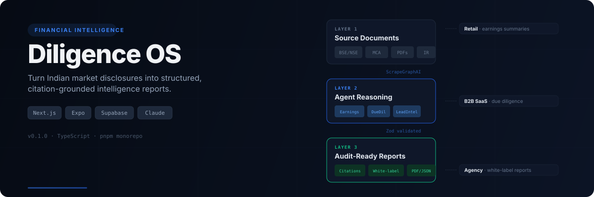
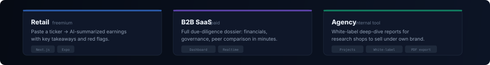
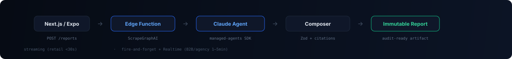

<p align="center">
  
</p>

Indian financial intelligence is fragmented across BSE/NSE disclosures, investor-relations PDFs, earnings call transcripts, and MCA filings. Diligence OS pulls these primary sources, runs structured reasoning through Anthropic Claude Managed Agents, and delivers audit-ready reports with per-claim citations — in minutes, not hours.

---

## Product tiers

<p align="center">
  
</p>

| Tier | Audience | Capability | Output |
| --- | --- | --- | --- |
| **Retail** (freemium) | Individual investors | Paste a ticker → AI earnings summary | Key takeaways, sentiment, red flags |
| **B2B SaaS** (paid) | Advisors, wealth managers | Full due-diligence dossier | Financials, governance, peer comparison |
| **Agency** (internal) | Research shops | White-label deep-dive reports | Client-branded, exportable PDF |

All three tiers share the same source layer and agent infrastructure. Go-to-market leads with Agency — small research shops are the first paying ICP.

---

## How it works

<p align="center">
  
</p>

**Three-layer report model:**

1. **Source Documents (L1)** — raw scraped data from BSE/NSE, earnings transcripts, IR PDFs. Shared globally, cached by URL and fetch window.
2. **Compositions (L2)** — typed JSON from Claude agent reasoning. Cached for retail/B2B (6h TTL), bypassed for agency to enforce data exclusivity.
3. **Reports (L3)** — immutable, per-org artifacts with materialized citations. Exportable as white-label PDF.

**Execution paths:**

- **Streaming** — retail earnings summaries (<30s). Edge Function pipes SSE directly to client.
- **Fire-and-forget** — B2B/agency deep-dives (1–5min). Returns `job_id` immediately; `pg_cron` polls Anthropic; frontend subscribes via Supabase Realtime.

**Agent topology:** three Anthropic Managed Agents sharing one `financial-runtime` environment, each with a typed output tool (`submit_earnings_summary`, `submit_due_diligence_report`, `submit_lead_intel_report`). Structured output via tool-call arguments validated against Zod schemas.

---

## Workspace layout

```
diligence-os/
├── web/           Next.js 15 · React 19 · Tailwind CSS · Supabase SSR
├── mobile/        Expo 53 · React Native · Google OAuth deep linking
├── supabase/
│   ├── functions/ Edge Functions (Deno): reports, companies, exports, job-runner, orgs, projects, me
│   │   └── _shared/  agent-orchestrator, report-composer, company-resolver, entitlements, source-ingestor
│   ├── migrations/   12 migration files covering auth, tenancy, RLS, companies, reports, cache, exports
│   └── config.toml
└── docs/
    └── PRD.md     Canonical spec (781 lines, locked after architectural grilling)
```

**Key modules in `supabase/functions/_shared/`:**

| Module | Responsibility |
| --- | --- |
| `agent-orchestrator.ts` | Manages Anthropic Managed Agent sessions, SSE streaming, and tool-call extraction |
| `report-composer.ts` | Validates agent output, materializes citations, writes L2/L3 artifacts |
| `company-resolver.ts` | Normalizes any input (CIN, ISIN, NSE symbol, BSE code, name) to a canonical `company_id` |
| `entitlements.ts` | Tier-gated quota enforcement with rolling-window usage tracking |
| `source-ingestor.ts` | ScrapeGraphAI integration with document deduplication and L1 caching |
| `report-schemas.ts` | Zod schemas for all three report types with discriminated citation locators |

---

## Requirements

- **Node.js 22+** with Corepack enabled (for pnpm)
- **Docker Desktop** for `supabase start` local stack
- Supabase project with access token
- API keys: ScrapeGraphAI, Groq, Gemini

## Getting started

**1. Clone and install:**

```bash
git clone https://github.com/Soham407/diligence-os.git
cd diligence-os
corepack pnpm install
```

**2. Configure environment:**

Copy `.env.example` to `.env` and fill in:

```bash
SUPABASE_PROJECT_REF=your-project-ref
SUPABASE_ACCESS_TOKEN=your-personal-access-token
NEXT_PUBLIC_SUPABASE_URL=your-supabase-url
NEXT_PUBLIC_SUPABASE_ANON_KEY=your-supabase-anon-key
SUPABASE_AUTH_EXTERNAL_GOOGLE_CLIENT_ID=your-google-client-id
SUPABASE_AUTH_EXTERNAL_GOOGLE_SECRET=your-google-client-secret
SGAI_API_KEY=your-scrapegraph-api-key
GROQ_API_KEY=your-groq-api-key
GEMINI_API_KEY=your-gemini-api-key
GEMINI_MODEL=gemini-2.5-flash
```

**3. Start local Supabase:**

```bash
corepack pnpm --filter supabase link    # connect to your project
corepack pnpm --filter supabase start   # start local stack with Docker
```

**4. Run the apps:**

```bash
# Web (Next.js)
corepack pnpm --filter web dev          # → http://localhost:3000

# Mobile (Expo)
corepack pnpm --filter mobile start
```

**5. Configure Google OAuth:**

- Set the Google client ID and secret in `.env`
- Add `http://localhost:54321/auth/v1/callback` to Google OAuth redirect URIs
- Add `http://localhost:3000/auth/callback` to Supabase redirect URLs

**6. Typecheck the workspace:**

```bash
corepack pnpm typecheck
```

---

## Architectural decisions

The PRD locks 11 architectural decisions resolved through a grilling session. Key ones:

| Decision | Summary |
| --- | --- |
| **Tenancy** | Every user auto-gets a personal org. All data is org-scoped — one RLS rule, one ownership column. |
| **Multi-org** | Users can belong to many orgs. Active org is a JWT claim, verified per-query via `current_active_org()`. |
| **RLS** | Membership-verified active org. Stale JWT after org removal returns NULL immediately. |
| **Report layers** | L1 global sources → L2 cached compositions (bypassed for agency) → L3 immutable per-org artifacts. |
| **Execution** | Hybrid: streaming for short reports, fire-and-forget + Realtime for long reports. |
| **Structured output** | Final-tool-call pattern. Agent ends every run by calling a typed output tool. |

Full details in [`docs/PRD.md`](docs/PRD.md).

---

## Notes

- `supabase init` has already scaffolded `supabase/config.toml`
- `supabase link` reads `SUPABASE_PROJECT_REF` + `SUPABASE_ACCESS_TOKEN` from your environment
- The Company Resolver normalizes BSE code, NSE symbol, ISIN, CIN, and free-text names to a single canonical company
- Layer 2 cache invalidation is automatic — when a new filing is scraped, the `source_doc_set_hash` changes and the cache misses

## License

Private repository.
